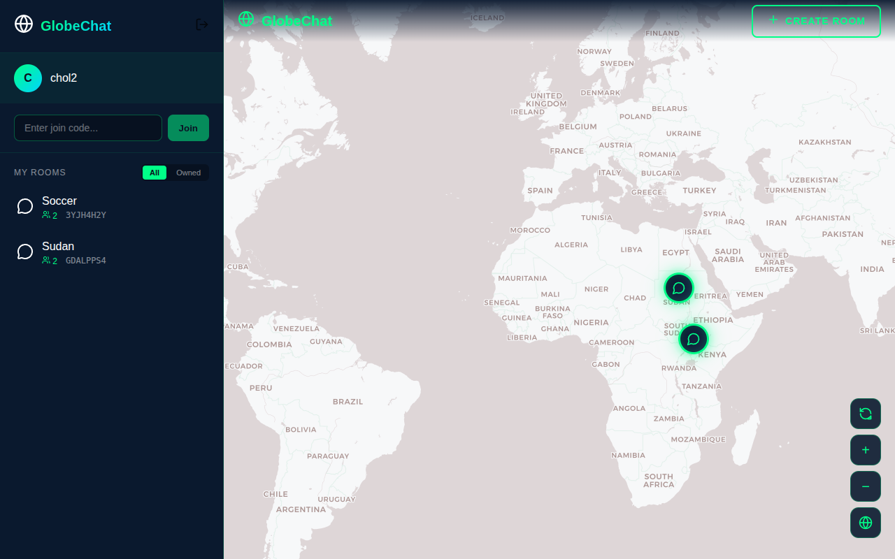
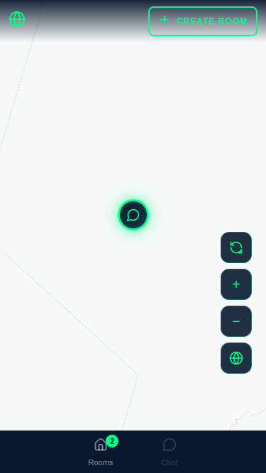
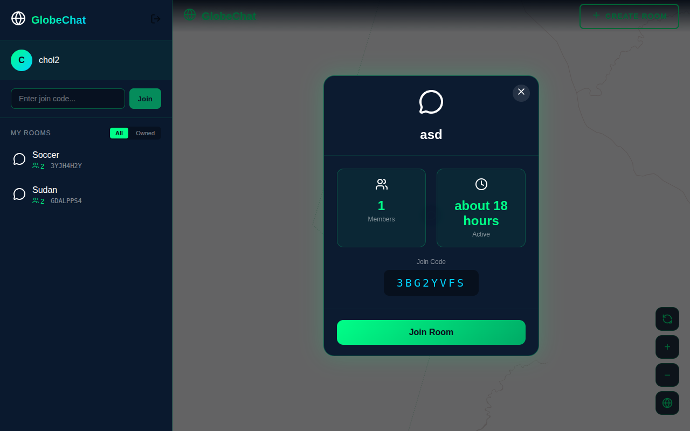
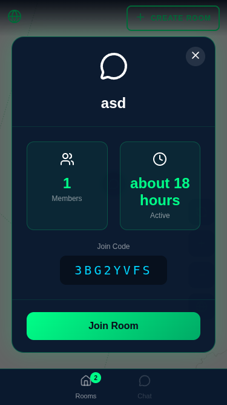
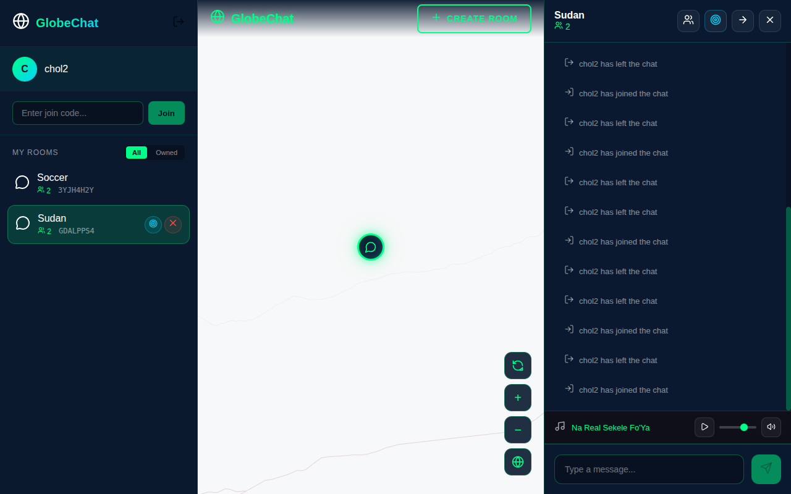
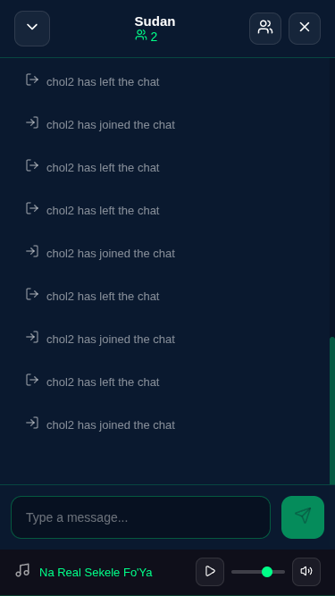
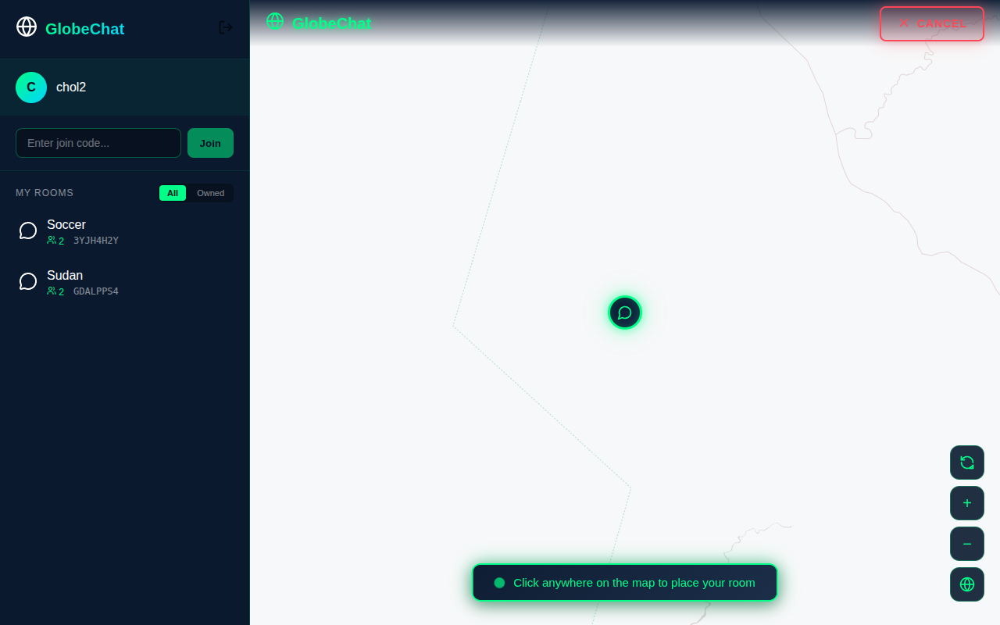

# GlobeChat

A real-time chat application where users can create and join chat rooms placed anywhere on an interactive world map.

## Overview

GlobeChat is a weekend project built to explore WebSocket-based real-time communication with a unique twist: chat rooms are geographically placed on a 3D globe. Users can discover rooms by exploring the map, join conversations happening around the world, and even set "moodsic" (mood music) to create the perfect atmosphere for their room.

Whether you want to chat with people interested in a specific location, create a virtual hangout spot, or just vibe with others while listening to shared music - GlobeChat makes it possible.

## Screenshots

### Globe View
Discover chat rooms placed around the world on an interactive map.

| Desktop | Mobile |
|---------|--------|
|  |  |

### Room Info
View room details, member count, and join code before entering.

| Desktop | Mobile |
|---------|--------|
|  |  |

### Chat Window
Real-time messaging with moodsic player controls at the bottom.

| Desktop | Mobile |
|---------|--------|
|  |  |

### Create Room
Click anywhere on the map to place a new chat room.



## Features

- **Map-Based Rooms**: Create chat rooms anywhere on an interactive globe
- **Real-Time Chat**: WebSocket-powered instant messaging
- **Moodsic**: Set mood music for your room that all members can enjoy
- **Join Codes**: Share 8-character codes to invite others (QR-friendly)
- **Role System**: Owner, Moderator, and Chatter roles with appropriate permissions
- **Moderation Tools**: Kick and ban users, promote moderators
- **Responsive Design**: Works seamlessly on desktop and mobile devices

## Tech Stack

- **Backend**: Spring Boot 4.x, Java 25, Spring Security (JWT), Spring WebSocket
- **Frontend**: Angular 21, MapLibre GL, STOMP over SockJS
- **Database**: PostgreSQL with Flyway migrations
- **Build**: Maven with GraalVM native image support

## Getting Started

### Prerequisites

- Java 25 (GraalVM recommended for native builds)
- Docker and Docker Compose
- Node.js 20+ (for frontend development)

### Local Development

1. **Start the database**:
   ```bash
   docker compose up -d
   ```

2. **Run the application**:
   ```bash
   ./mvnw spring-boot:run -Pdev
   ```

   The application will be available at `http://localhost:9090`

### Running Tests

```bash
# Unit tests only
./mvnw test

# Integration tests only
./mvnw verify -DskipUTs

# All tests
./mvnw verify
```

## Building for Production

### Standard JAR Build

```bash
./mvnw clean package -Pprod -DskipTests
```

### Native Image with GraalVM

For faster startup and lower memory footprint, build a native executable:

```bash
# Ensure GraalVM is installed and JAVA_HOME is set
./mvnw clean package -Pnative -DskipTests
```

The native binary will be created at `target/globechat`.

### Running the Native Binary

```bash
# Set required environment variables
export DB_URL=jdbc:postgresql://localhost:5432/globechat
export DB_USER=globechat
export DB_PASSWORD=your_password
export JWT_SECRET=your_secret_key

# Run the application
./target/globechat
```

## Contributing

Contributions are welcome! Here's how you can help:

1. **Fork the repository**
2. **Create a feature branch**: `git checkout -b feature/amazing-feature`
3. **Make your changes** and add tests if applicable
4. **Run the test suite**: `./mvnw verify`
5. **Commit your changes**: `git commit -m 'Add amazing feature'`
6. **Push to the branch**: `git push origin feature/amazing-feature`
7. **Open a Pull Request**

### Development Guidelines

- Follow existing code style and patterns
- Write tests for new functionality
- Update documentation as needed
- Keep commits focused and well-described

## License

This project is licensed under the MIT License - see the [LICENSE](LICENSE) file for details.

---

Built with care by [Chol Nhial](mailto:chol.nhial.chol@gmail.com)
